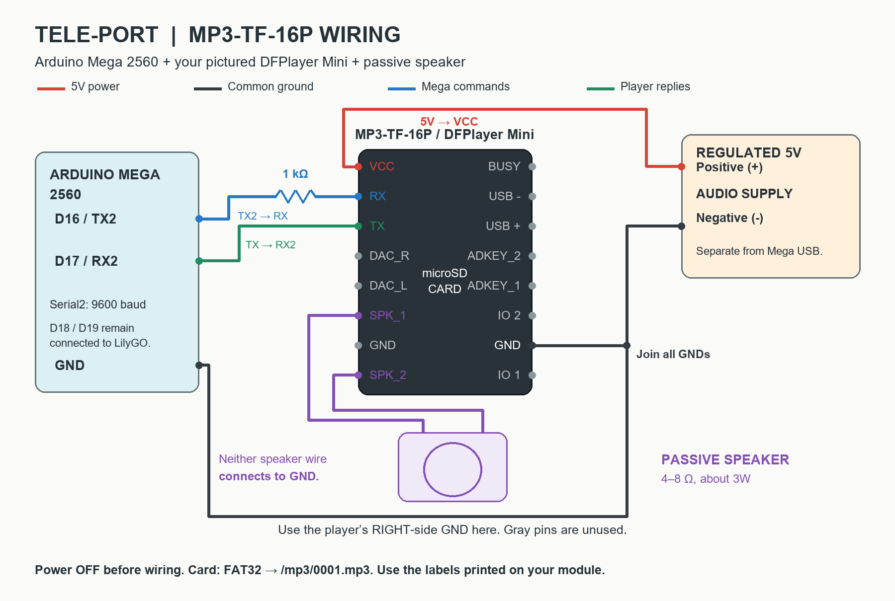
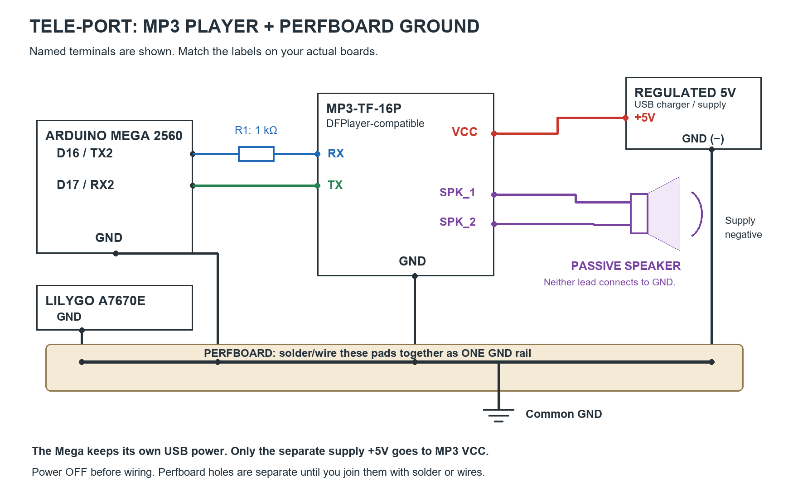

# MP3-TF-16P: give your bus a voice

Think of the Mega as the teacher, the MP3 player as a little music box, the microSD card as its song book, and the speaker as its mouth. The Mega says "play number 1," and the music box reads that song from its card.

These instructions use the common DFPlayer-compatible MP3-TF-16P. Connect using the pin names printed on your board; do not guess a pin from its position.



For a perfboard build, join the player GND, Mega GND, LilyGO GND, and audio supply negative to one soldered GND rail:



## What you need

- Arduino Mega 2560 and MP3-TF-16P module.
- A 1 kOhm resistor (brown-black-red-gold).
- A passive 4-8 ohm speaker, rated for about 3W.
- A microSD card, up to 32GB, formatted FAT32.
- A regulated 5V audio supply and jumper wires.

## Connect the wires with power off

| From | To | What it does |
|---|---|---|
| Regulated 5V supply positive (+) | Player VCC | Gives the music box power. |
| Supply negative (-) | Player GND | Power return. |
| Mega GND | Player GND / supply negative | Lets the boards share the same reference. |
| Mega D16 / TX2 | 1 kOhm resistor, then player RX | Mega tells the music box what to play. |
| Player TX | Mega D17 / RX2 | Music box talks back to the Mega. |
| Player SPK1 | One speaker lead | Sound output. |
| Player SPK2 | Other speaker lead | Other sound output. |

Neither speaker lead goes to GND. A USB or computer speaker with its own amplifier is not the passive speaker shown here; amplified outputs use different wiring. Keep the existing Mega-to-LilyGO wires on D18/D19.

```text
Regulated 5V (+) -------------------- VCC   MP3-TF-16P
Supply (-) -----+-------------------- GND
Mega GND -------+

Mega D16 TX2 ----[ 1 kOhm ]---------- RX
Mega D17 RX2 <---------------------- TX

                    SPK1 ----[ speaker ]---- SPK2
                    Card slot: insert microSD
```

The 1 kOhm series resistor follows DFRobot's UART wiring recommendation; it is not the Mega-to-ESP32 voltage divider. Use a separate regulated 5V supply for the player/speaker and join its negative to Mega GND. Do not connect its positive output to another powered 5V rail.

## Put the songs in the music box

Copy the existing `firmware/sd_card/mp3` folder onto the microSD card so the card has:

```text
microSD card
  mp3
    0001.mp3   generic approach announcement
    0002.mp3   PITX
    0003.mp3   SM Pala-Pala
    ...        other numbered announcements
```

Use four-digit names with the real `.mp3` extension. Insert the card in the MP3 module, not the LilyGO. Power off before inserting/removing it.

## First, try the sound test

1. In Arduino IDE, install **DFRobotDFPlayerMini** using Library Manager.
2. Open `mp3_tf_16p_test/mp3_tf_16p_test.ino`.
3. Select **Arduino Mega or Mega 2560**, processor **ATmega2560**, and the Mega's port.
4. Upload to the Mega, leaving the LilyGO's GPS sketch on the LilyGO.
5. Open Serial Monitor at **115200 baud**. Wait for `Ready!`.
6. Type **1** and press Send. You should hear `0001.mp3`. Try **2** and **3** for the other announcements; **s** stops playback.

If it says `Player not found`, check the inserted FAT32 card, 5V/GND connections, and crossed TX/RX wires, then reset. If it is ready but silent, check the speaker and filenames. Do not increase to maximum volume immediately.

## Then put the seat code back

The sound test does not read seat sensors. When the sound works, upload `mega_seat_sensor/mega_seat_sensor.ino` back to the Mega to restore the combined sensor-and-voice firmware.

That combined sketch already starts the player on `Serial2` at 9600 baud, sets volume 20, and handles a `VOICE,1` line from the LilyGO by calling `voicePlayer.playMp3Folder(1)`. Keep sensors 1-5 wired as they are.

The existing tracker asks the backend for active ticket drop-off coordinates. If one is within 250 meters, the LilyGO asks the Mega to play the selected announcement. Tickets with only a named fare point and no stored drop-off coordinates are not returned by that hardware endpoint, so use the standalone test to verify the speaker regardless of ticket/GPS state.

Official wiring, microSD naming, and library reference:
https://wiki.dfrobot.com/dfr0299/docs/20905
https://wiki.dfrobot.com/dfr0299
