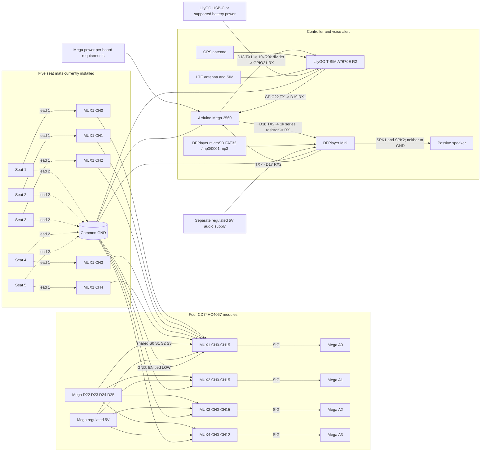

# TELE-PORT hardware wiring

This wiring matches the current firmware: Arduino Mega 2560, four CD74HC4067 mux boards, five connected FLEXKYS seat mats (seats 1-5), LilyGO T-SIM A7670E R2, DFPlayer Mini, and one passive speaker. The other 56 positions remain part of the 61-seat layout and are reported offline; they do not have sensor wires installed yet.

## Wiring overview

## Pin and power table

| Connection | Wiring |
|---|---|
| Common ground | Join Mega GND, all mux GND, LilyGO GND, DFPlayer GND, and the negative terminal of the DFPlayer supply. |
| Mux power | Each mux VCC to Mega regulated 5V. Each mux EN to GND (enable is active LOW). |
| Mux address | Mega D22 -> S0, D23 -> S1, D24 -> S2, D25 -> S3 on all four muxes in parallel. |
| Mux SIG | MUX1 SIG -> A0, MUX2 -> A1, MUX3 -> A2, MUX4 -> A3. Firmware configures these as `INPUT_PULLUP`. |
| Sensors 1-5 | Sensor 1 lead 1 -> MUX1 CH0, sensor 2 -> CH1, through sensor 5 -> CH4. The other lead of each mat -> common GND. Lead polarity does not matter. |
| Mega to LilyGO UART | Mega TX1 D18 -> 10 kohm resistor -> GPIO21 RX; GPIO21 RX -> 20 kohm resistor -> GND. This divider reduces the Mega's 5V TX signal to about 3.3V. |
| LilyGO to Mega UART | GPIO22 TX -> Mega RX1 D19. The ESP32 3.3V output is read by the Mega input. |
| Mega to DFPlayer UART | Mega TX2 D16 -> 1 kohm series resistor -> DFPlayer RX. DFPlayer TX -> Mega RX2 D17. |
| Speaker/audio | Passive speaker across DFPlayer SPK1 and SPK2. Do not connect either speaker lead to GND. Insert a FAT32 card in the DFPlayer with `/mp3/0001.mp3`. |
| Power | Power the Mega and LilyGO using their supported inputs. Power DFPlayer from a separate regulated 5V supply sized for the speaker load. Do not power the LilyGO cellular modem or speaker from a Mega GPIO or assume the Mega 5V rail can supply their peak current. Join all grounds. |

Mux channel numbering follows the firmware: MUX1 CH0-CH15 = seats 1-16; MUX2 = seats 17-32; MUX3 = seats 33-48; MUX4 CH0-CH12 = seats 49-61. Only MUX1 CH0-CH4 are wired in the current prototype. Seats 6-61 remain in the 61-seat display but are marked offline and are not scanned.

The FLEXKYS seat occupancy sensor is a two-lead resistive pressure sensor. With the firmware's `INPUT_PULLUP`, an unpressed high-resistance mat reads HIGH and a pressed low-resistance mat pulls the selected mux input LOW. The four muxes are powered from 5V, matching the Mega's logic level.

The LilyGO TF/microSD slot is not used for audio by this firmware. The Mega sends `VOICE,<number>` to the DFPlayer, which plays files from its own microSD. The DFPlayer is the speaker amplifier; the T-SIM A7670E is not directly wired to the speaker.

The firmware maps Mega Serial1 to LilyGO GPIO21 (RX) and GPIO22 (TX). Those pins are also labeled SDA/SCL on the T-SIM board and are reserved for this UART in this build. Confirm your exact board revision's labels before soldering.